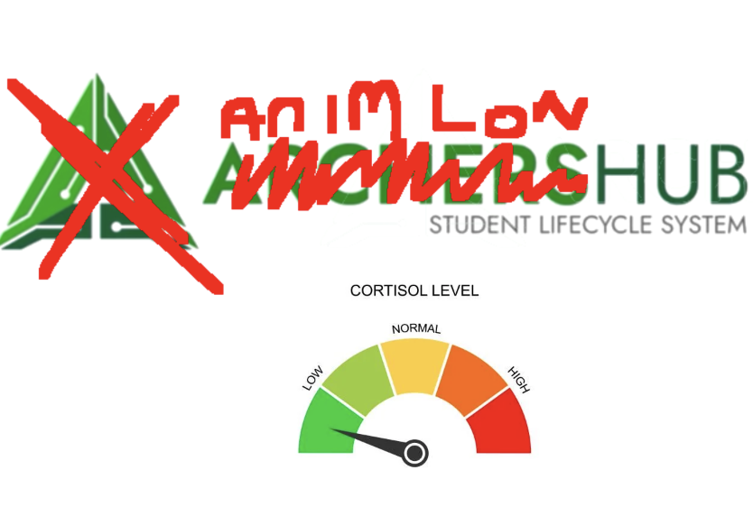

# PLEASE WATCH THE VIDEO BELOW OR YOURE GONNA SPIKE MY CORTISOL (turn the volume up too lol)

https://github.com/user-attachments/assets/e5b05f6e-43f8-4671-893b-f385fb95e9d3



# AnimLow Cortisol

AnimLow Cortisol is an extension which helps lower your cortisol while using ArchersHub (autofills captcha).

## What It Does

- Runs OCR on ArchersHub Captcha *Locally*
- Tries to autofill the captcha field after the challenge image loads.
- Lets you rerun OCR from the extension toolbar button.
- Includes a checkbox to hide the captcha block after autofill.

## Install From The GitHub Release ZIP

1. Go to the GitHub Releases page for this repository or click [here](https://github.com/JG8203/archershub-login-ocr/releases/latest) to download the latest release
2. Download `animlow-cortisol-release.zip` from the latest release.
3. Open your browser and go to `chrome://extensions`.
4. Turn on `Developer mode` using the toggle in the top-right corner.
6. Drag the downloaded file onto the extensions window.

## Use In Chrome

1. Open the Archers Hub login page in Chrome.
2. Wait for the login challenge image to finish loading.
3. The extension will try to read the image automatically and fill the captcha field.
4. If you want to rerun OCR, click the extension toolbar icon.
5. If you want the captcha block hidden after autofill, use the on-page checkbox.

## Developer Workflow

These steps are only for developers working from source.

```bash
npm install
npm run build
npm run check
npm run package:release
```

## Project Notes

- OCR uses packaged local assets under `vendor/` during the build process.
- The committed repository does not require end users to fetch npm dependencies.
- The release build is scoped to the production Archers Hub host only.

## Docs

- [Privacy policy](./PRIVACY.md)
- [Release checklist](./RELEASE.md)
